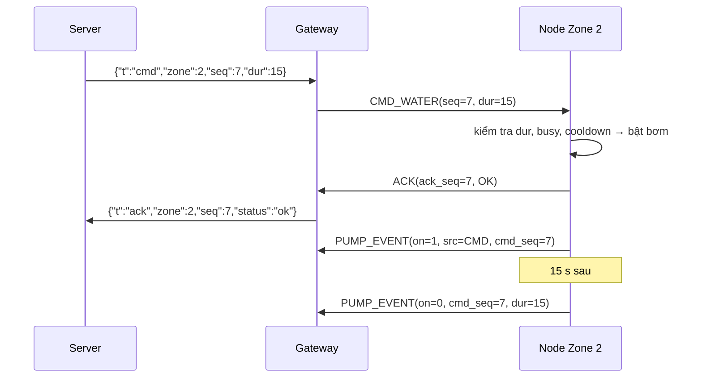
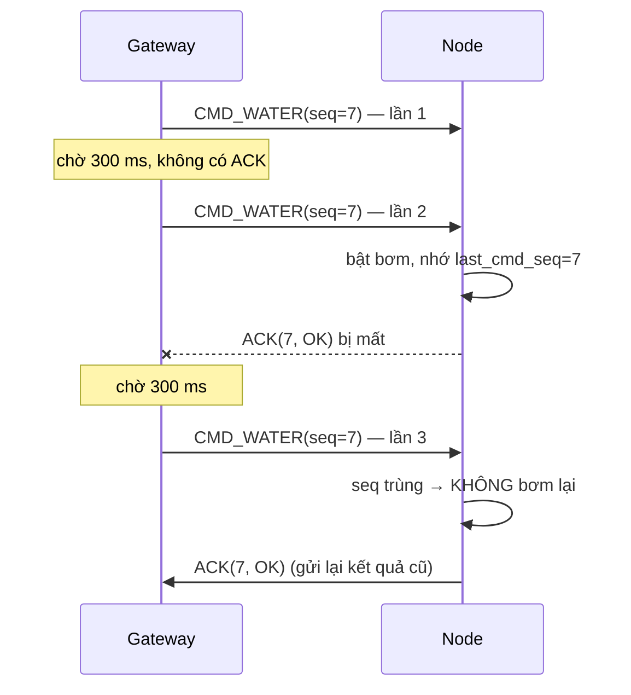

# Khung gói tin ESP-NOW (Node ⇄ Gateway)

> Tài liệu chi tiết cho §5 của [DESIGN.md](DESIGN.md). Mã nguồn: [firmware/lib/protocol/protocol.h](../firmware/lib/protocol/protocol.h)

## 1. Quy ước chung

| Mục | Quy ước |
|---|---|
| Truyền | ESP-NOW unicast theo MAC (bảng ghi cứng trong `config.h`), kênh 1 |
| Mã hóa byte | Little-endian, struct `#pragma pack(1)` (không padding) |
| Kích thước | Tối đa 19 byte (ESP-NOW cho phép 250 byte) |
| Kiểm lỗi | CRC32 có sẵn ở lớp MAC 802.11. Tầng ứng dụng kiểm tra `type` hợp lệ và `len == sizeof(struct)` (`msg_validate()`) |
| Số thực | Gửi dạng số nguyên có hệ số: độ ẩm đất ×10, nhiệt độ ×100, độ ẩm không khí ×100 |
| `seq` | 16 bit, mỗi bên tự tăng cho gói **mình gửi**. Lệnh từ gateway mang `seq` do server cấp. |

## 2. Header chung (4 byte)

| Offset | Trường | Kiểu | Mô tả |
|---|---|---|---|
| 0 | `type` | uint8 | Loại gói (bảng §3) |
| 1 | `zone_id` | uint8 | 1..3: Zone gửi (uplink) hoặc Zone nhận (downlink) |
| 2 | `seq` | uint16 | Số thứ tự gói |

## 3. Các loại gói

| `type` | Tên | Chiều | Kích thước | Cần ACK ứng dụng |
|---|---|---|---|---|
| 1 | `TELEMETRY` | Node → GW | 19 B | Không |
| 2 | `PUMP_EVENT` | Node → GW | 10 B | Không |
| 3 | `ACK` | Node → GW | 7 B | — |
| 10 | `CMD_WATER` | GW → Node | 6 B | **Có** |
| 11 | `CMD_STOP` | GW → Node | 4 B | **Có** |
| 12 | `CONFIG` | GW → Node | 10 B | **Có** |
| 13 | `BEACON` | GW → Node | 8 B | Không |

### 3.1 `TELEMETRY` — gói dữ liệu cảm biến (19 byte)

Nút gửi mỗi 30 giây. Gói này đồng thời là heartbeat.

| Offset | Trường | Kiểu | Đơn vị / mã hóa |
|---|---|---|---|
| 0–3 | header | | `type = 1` |
| 4 | `soil_raw` | uint16 | ADC sau lọc (0..4095) |
| 6 | `soil_x10` | uint16 | Độ ẩm đất % × 10 (432 → 43.2 %) |
| 8 | `temp_x100` | int16 | Nhiệt độ °C × 100 (2841 → 28.41 °C) |
| 10 | `hum_x100` | uint16 | Độ ẩm không khí %RH × 100 |
| 12 | `pump_on` | uint8 | Trạng thái bơm: 0 = tắt, 1 = đang chạy |
| 13 | `node_mode` | uint8 | 0 = NORMAL, 1 = FALLBACK |
| 14 | `flags` | uint8 | bit0 lỗi SHT30, bit1 lỗi cảm biến đất, bit2 đang cooldown |
| 15 | `uptime_s` | uint32 | Thời gian chạy của nút (giây) |

Ví dụ: Zone 1, seq 120, raw 2345, độ ẩm đất 43.2 %, 28.41 °C, 71.20 %RH, bơm tắt, uptime 3600 s:

```
01 01 78 00 | 29 09 | B0 01 | 19 0B | D0 1B | 00 | 00 | 00 | 10 0E 00 00
```

### 3.2 `CMD_WATER` — gói lệnh tưới (6 byte)

| Offset | Trường | Kiểu | Mô tả |
|---|---|---|---|
| 0–3 | header | | `type = 10`, `zone_id` = Zone đích, `seq` = seq lệnh do server cấp |
| 4 | `duration_s` | uint16 | Thời lượng tưới, giây, 1..`pump_max_s` |

Ví dụ: tưới Zone 2 trong 15 giây, seq 7: `0A 02 07 00 0F 00`

### 3.3 `ACK` — xác nhận lệnh (7 byte)

| Offset | Trường | Kiểu | Mô tả |
|---|---|---|---|
| 0–3 | header | | `type = 3`, `seq` = seq uplink của nút |
| 4 | `ack_seq` | uint16 | `seq` của lệnh được xác nhận |
| 6 | `status` | uint8 | 0 OK · 1 REJ_COOLDOWN · 2 REJ_BUSY · 3 REJ_INVALID |

Ví dụ: Zone 2 chấp nhận lệnh seq 7: `03 02 51 00 07 00 00`

### 3.4 `PUMP_EVENT` — bơm bật/tắt (10 byte)

| Offset | Trường | Kiểu | Mô tả |
|---|---|---|---|
| 0–3 | header | | `type = 2` |
| 4 | `on` | uint8 | 1 = vừa bật, 0 = vừa tắt |
| 5 | `source` | uint8 | 0 CMD · 1 FALLBACK · 2 SAFETY_STOP |
| 6 | `cmd_seq` | uint16 | Lệnh gây ra lần tưới này (0 nếu nút tự tưới fallback) |
| 8 | `duration_s` | uint16 | Thời gian thực tế đã chạy (chỉ có nghĩa khi `on = 0`) |

Ví dụ: Zone 2 bật rồi tắt sau 15 giây theo lệnh seq 7:
```
02 02 52 00 01 00 07 00 00 00   (ON)
02 02 53 00 00 00 07 00 0F 00   (OFF, chạy 15 s)
```

### 3.5 `CMD_STOP` (4 byte), `CONFIG` (10 byte), `BEACON` (8 byte)

| Gói | Payload sau header |
|---|---|
| `CMD_STOP` | — (tắt bơm ngay) |
| `CONFIG` | `soil_low_x10` uint16 · `pump_max_s` uint16 · `fallback_water_s` uint16 |
| `BEACON` | `epoch` uint32 (0 nếu server chưa gửi giờ) |

Ví dụ `CONFIG` cho Zone 1 (ngưỡng 35.0 %, tối đa 30 s, fallback 10 s, seq 9): `0C 01 09 00 5E 01 1E 00 0A 00`
Ví dụ `BEACON` gửi Zone 1: `0D 01 0C 00 80 44 EE 6A`

## 4. Cơ chế xác nhận (ACK)

Có hai lớp xác nhận:

1. **Lớp MAC (ESP-NOW có sẵn)**: callback `esp_now_send_cb` báo `ESP_NOW_SEND_SUCCESS` khi nút nhận đã nhận được frame. Dùng cho telemetry và pump event.
2. **Lớp ứng dụng (`MSG_ACK`)**: chỉ dùng cho lệnh. ACK xác nhận rằng nút đã **kiểm tra và chấp nhận (hoặc từ chối)** lệnh, chứ không chỉ là đã nhận được frame.

### 4.1 Lệnh tưới thành công



### 4.2 Mất gói và gửi lại



### 4.3 Quy tắc

| Bên | Quy tắc |
|---|---|
| Gateway | Gửi lệnh và chờ ACK có `ack_seq == seq` trong **300 ms**. Gửi tối đa **3 lần**. Hết lần thì báo server `status: "timeout"`. Mỗi Zone xử lý tuần tự một lệnh. |
| Node | Nhớ `last_cmd_seq` và `last_ack_status`. Lệnh trùng `seq` thì chỉ gửi lại ACK cũ, không thực thi lại. |
| Node | Lệnh mới: kiểm tra `1 ≤ dur ≤ pump_max_s` (nếu sai → `REJ_INVALID`), bơm đang chạy (→ `REJ_BUSY`), còn cooldown (→ `REJ_COOLDOWN`). |
| Node | Telemetry/PumpEvent gửi lỗi ở lớp MAC thì gửi lại ngay tối đa 2 lần rồi bỏ. Trạng thái bơm vẫn có trong telemetry kế tiếp. |
| Gateway | Bỏ các gói có MAC nguồn không nằm trong bảng, có `zone_id` không khớp MAC, hoặc `msg_validate()` sai. |

## 5. Ánh xạ sang JSON (Gateway → Server)

| Gói ESP-NOW | JSON line |
|---|---|
| `TELEMETRY` | `{"t":"tel","zone":1,"seq":120,"soil":43.2,"soil_raw":2345,"temp":28.41,"hum":71.20,"pump":0,"mode":"normal","flags":0,"up":3600,"rssi":-58}` |
| `PUMP_EVENT` | `{"t":"pump","zone":2,"on":0,"src":"cmd","cmd_seq":7,"dur":15}` |
| `ACK` | `{"t":"ack","zone":2,"seq":7,"status":"ok"}` |

Chiều xuống và các bản tin khác: xem DESIGN.md §6.
